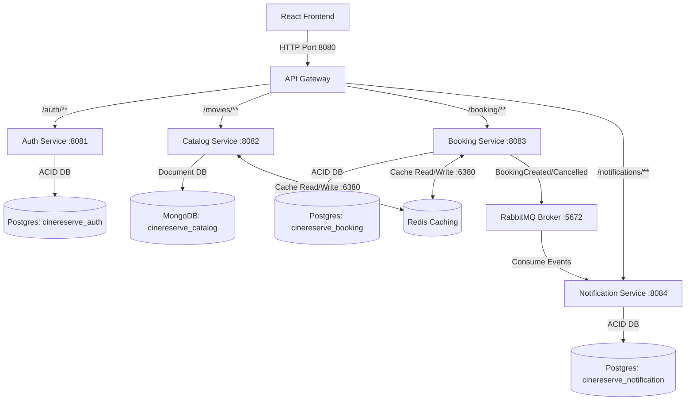
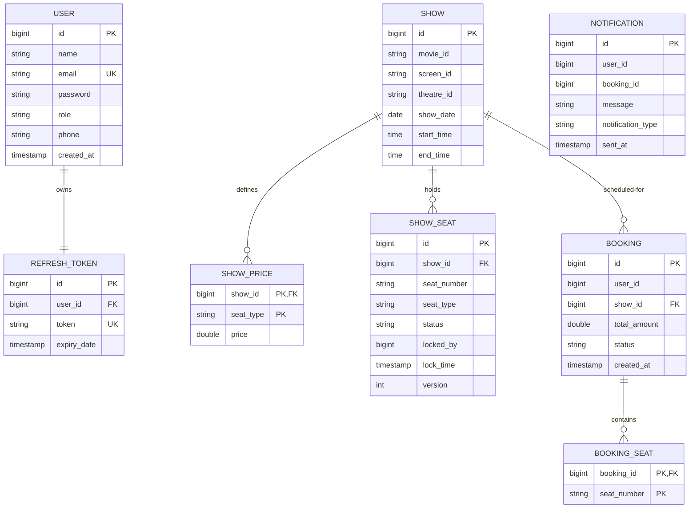
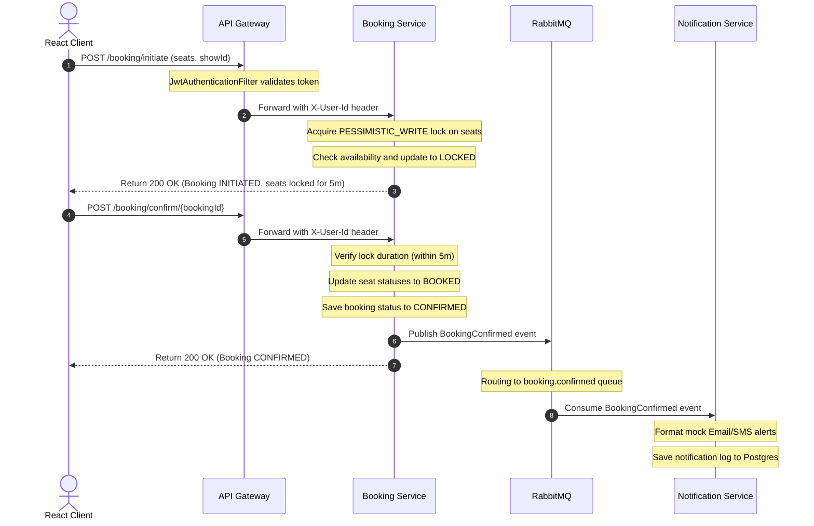

# Architecture and Design Specification - CineReserve

This document details the software architecture, entity relationships, and execution sequences of the CineReserve platform.

---

## 1. System Architecture

The following diagram outlines the routing of client requests through the API Gateway to downstream microservices, along with shared communications.

---

## 2. Entity Relationship Diagram (ERD)

The diagram below maps relational data schemas across databases.

---

## 3. Booking Sequence Diagram

This diagram maps step-by-step communication during seat selection, locking, and transaction confirmation.

